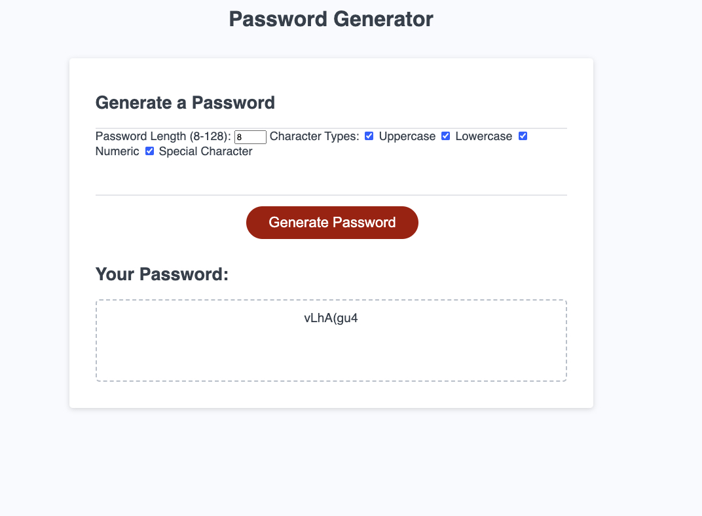

# Homework.3
# <Password Generator >

## Description

I have created a password generator that asks the user to select the lenght and creterias for the password generator.  O

## Table of Contents (Optional)

#Installation: 
1. access the website from the link provided.  Also the source codes are available on Github. 

What are the steps required to install your project? Provide a step-by-step description of how to get the development environment running.

## Usage

## Credits
Steven Francius

## License

Mit license

